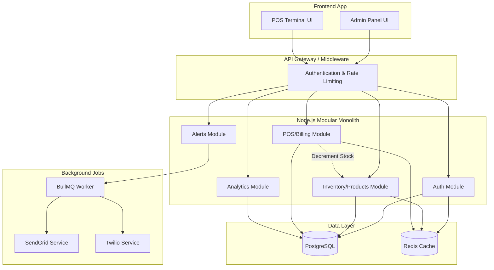

# Toy Store Inventory & POS Management System - Implementation Blueprint

## Tech Stack Decision

*   **Frontend Framework**: **React with Vite**. Justification: Excellent ecosystem, fast build times with Vite, and ideal for building highly interactive Single Page Applications (SPAs) like POS systems where fast state updates are critical.
*   **Backend Framework**: **Node.js with Express** (currently implemented). Justification: Lightweight, huge ecosystem, easy to share TypeScript types with the frontend via a monorepo.
*   **Database**:
    *   **Primary**: **PostgreSQL**. Justification: ACID compliance is non-negotiable for billing and inventory. Excellent support for complex analytics queries.
    *   **Caching**: **Redis**. Justification: Required for fast QR scan lookups (<500ms), session management (refresh tokens), and rate limiting.
*   **ORM**: **Prisma** (currently implemented). Justification: Typesafe database access, excellent migration system, improves developer velocity.
*   **QR/Barcode Generation Library**: **`qrcode`** and **`bwip-js`** (Node.js). Justification: Reliable, server-side generation ensures consistency and allows embedding HMAC signatures securely.
*   **Scanner Integration Approach**: **USB/Bluetooth HID Barcode Scanner + Mobile Camera Fallback**. Justification: Hardware scanners act as keyboard emulators, ensuring the fastest checkout process (<50ms reads). We will implement a global keypress listener in the React POS component. A mobile camera fallback (using `html5-qrcode`) supports tablet usage without peripherals.
*   **Charting Library**: **Recharts** or **Chart.js**. Justification: Excellent React integration, highly customizable for the analytics dashboard.
*   **Notification Service**: **BullMQ** (Redis-backed) with **SendGrid** (Email) and **Twilio** (SMS). Justification: Offloads slow network requests to background workers, ensuring the main thread isn't blocked during checkout or inventory updates.
*   **Deployment Platform**: **Docker** + **AWS ECS/Fargate** or **Render**. Justification: Containerization ensures consistency between dev and prod. Managed container services scale well for 10,000+ products.

## System Architecture

**Decision**: **Modular Monolith**
*Justification*: A microservices architecture introduces unnecessary operational complexity (distributed transactions, network latency) for a system of this scale. A modular monolith provides the benefits of clean separation of concerns without the overhead. We will structure the backend by domain (auth, products, pos, etc.).

### Component Diagram



## Database Design (ERD)

```mermaid
erDiagram
    User ||--o{ Bill : generates
    User ||--o{ Product : creates
    User ||--o{ StockAlert : acknowledges
    
    Category ||--o{ Category : parent_child
    Category ||--o{ Product : categorizes
    Category ||--o{ SalesAnalytics : tracks
    
    Product ||--o| QRCode : has
    Product ||--o{ BillItem : included_in
    Product ||--o{ StockAlert : triggers
    Product ||--o{ SalesAnalytics : tracks
    
    Bill ||--|{ BillItem : contains

    User {
        uuid id PK
        varchar email UK
        varchar password_hash
        varchar full_name
        enum role "super_admin, admin, cashier"
        boolean is_active
        datetime last_login
    }

    Category {
        uuid id PK
        varchar name UK
        varchar slug UK
        uuid parent_id FK
    }

    Product {
        uuid id PK
        varchar sku UK
        varchar name
        uuid category_id FK
        decimal price
        decimal cost_price
        int quantity
        int low_stock_threshold
        boolean is_active
    }

    QRCode {
        uuid id PK
        uuid product_id FK UK
        text qr_payload
        varchar barcode_payload
        varchar hmac_signature
    }

    Bill {
        uuid id PK
        varchar bill_number UK
        uuid cashier_id FK
        decimal subtotal
        decimal discount_value
        decimal tax_amount
        decimal total_amount
        enum payment_status "paid, pending, refunded"
    }

    BillItem {
        uuid id PK
        uuid bill_id FK
        uuid product_id FK
        decimal unit_price
        int quantity
        decimal line_total
    }

    StockAlert {
        uuid id PK
        uuid product_id FK
        enum alert_type "low_stock, out_of_stock"
        boolean is_acknowledged
    }

    SalesAnalytics {
        uuid id PK
        date date
        uuid product_id FK
        int units_sold
        decimal revenue
    }
```

## API Structure

### Auth (`/api/auth`)
*   `POST /login` - Authenticate user
*   `POST /refresh` - Refresh JWT access token
*   `POST /logout` - Invalidate session
*   `GET /me` - Get current user profile

### Products / Inventory (`/api/products`)
*   `GET /` - List/Search products (Pagination, Filters)
*   `GET /:id` - Get product details
*   `POST /` - Create product (Generates QR/Barcode)
*   `PATCH /:id` - Update product
*   `DELETE /:id` - Soft delete product
*   `PATCH /:id/stock` - Manual stock adjustment

### Categories (`/api/categories`)
*   `GET /` - List category tree
*   `POST /` - Create category
*   `PATCH /:id` - Update category

### QR/Barcode (`/api/qr`)
*   `POST /scan` - Process scan payload, verify HMAC, return product info (Optimized endpoint)

### POS/Billing (`/api/pos`)
*   `POST /bills` - Create new bill (Decrements stock transactionally)
*   `GET /bills` - List sales history
*   `GET /bills/:id` - Get bill details / invoice data
*   `POST /bills/:id/refund` - Process refund (Restores stock)

### Alerts (`/api/alerts`)
*   `GET /` - List active stock alerts
*   `PATCH /:id/acknowledge` - Mark alert as handled

### Analytics (`/api/analytics`)
*   `GET /dashboard` - Overview metrics (revenue, top products)
*   `GET /revenue` - Revenue trends over time
*   `GET /inventory-value` - Current stock valuation

## Folder Structure (Monorepo)

```text
/
├── apps/
│   ├── client/                 # React Vite App
│   │   ├── src/
│   │   │   ├── components/     # Reusable UI (Buttons, Modals)
│   │   │   ├── features/       # Domain modules (POS, Inventory, Dashboard)
│   │   │   ├── hooks/          # Custom React hooks (e.g., useScanner)
│   │   │   ├── services/       # API clients (Axios/React Query)
│   │   │   └── store/          # Zustand state management
│   │   └── package.json
│   │
│   └── server/                 # Express Node.js App
│       ├── prisma/             # Schema and migrations
│       ├── src/
│       │   ├── config/         # DB, Redis, Env
│       │   ├── middleware/     # Auth, Rate limiting, Error handling
│       │   ├── modules/        # Domain-driven backend modules
│       │   ├── jobs/           # BullMQ worker definitions
│       │   └── utils/          # HMAC, PDF generation, Pagination
│       └── package.json
│
├── packages/
│   └── shared/                 # Shared code
│       ├── types/              # TS interfaces (e.g., DTOs)
│       ├── validators/         # Zod schemas used by both frontend/backend
│       └── package.json
│
├── package.json                # Root workspace config
└── turbo.json                  # Turborepo build pipeline
```

## Security Considerations

1.  **JWT Authentication**: Short-lived Access Tokens (15m) in memory/header, long-lived Refresh Tokens (7d) in HTTP-only, secure cookies.
2.  **Role-Based Access Control (RBAC)**: Route guards on frontend and backend (e.g., cashiers cannot access inventory value reports).
3.  **QR Forgery Prevention**: All QR payloads include an HMAC-SHA256 signature using a secret key. Scans are rejected if the signature is invalid, preventing malicious QR code generation.
4.  **Rate Limiting**: Strict limits on login attempts to prevent brute force, and specialized rate limits on the `/scan` endpoint (60/min) to prevent enumeration.
5.  **Input Sanitization**: All incoming requests validated strictly against Zod schemas in the shared package.
6.  **Transaction Safety**: Billing endpoint uses Prisma `$transaction` to ensure order creation and stock decrement succeed or fail together.

## Scalability Planning

1.  **Caching Strategy (Redis)**: 
    *   Products and SKUs cached heavily (10 min TTL) with targeted invalidation on update.
    *   Category trees cached until structural changes occur.
    *   `/scan` endpoint hits Redis first (`O(1)` lookup by SKU), enabling <50ms response times.
2.  **Database Indexing**: Indexes applied to `sku`, `category_id`, `created_at`, `payment_status`. Analytics table unique constraint on `(date, product_id)` allows efficient UPSERTs.
3.  **Background Jobs (BullMQ)**: 
    *   Stock reduction triggers an asynchronous job to check if `quantity <= low_stock_threshold`. If true, the worker creates a `StockAlert` and sends emails/SMS via SendGrid/Twilio without blocking the checkout HTTP response.
4.  **Analytics Rollups**: A cron job runs nightly to aggregate daily sales into the `SalesAnalytics` table, preventing heavy `SUM()` queries on the `BillItem` table for historical reporting.

## Development Roadmap

### Phase 1: Core Setup (Weeks 1-2)
*   Initialize monorepo (Turborepo, Shared package).
*   Setup Database schemas, Prisma migrations, and Redis connection.
*   Implement Authentication module (JWT, RBAC).
*   Setup basic React routing and layout.

### Phase 2: Inventory & QR Engine (Weeks 3-4)
*   Implement Category and Product CRUD APIs.
*   Build QR/Barcode generation utilities with HMAC signing.
*   Develop Frontend Inventory management screens (Lists, Forms, Image Upload).
*   Implement Redis caching layer for products.

### Phase 3: POS & Billing System (Weeks 5-6)
*   Build the POS Terminal UI (Cart state, layout).
*   Integrate barcode scanner (Hardware listener + Camera fallback).
*   Implement highly optimized `/scan` API endpoint.
*   Implement Transactional Checkout API (Bill generation + Stock decrement).
*   Generate Printable Invoices (PDFKit/Frontend printing).

### Phase 4: Analytics & Notifications (Weeks 7-8)
*   Setup BullMQ workers for async background tasks.
*   Implement Low-Stock alert system with Email/SMS integration.
*   Build nightly aggregation jobs for analytics.
*   Develop Admin Dashboard UI with Recharts (Sales trends, top products).
*   Final QA, Load Testing, and Deployment.

---

> [!IMPORTANT]
> **User Review Required**
> Please review the proposed architecture, tech stack, and development roadmap. Let me know if you approve this blueprint or if any adjustments are needed before we begin implementation.
